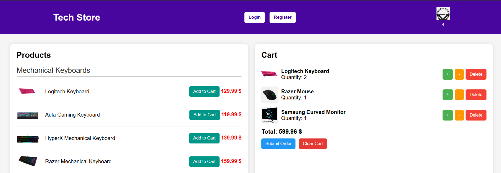

# WebApplicationF

# Tech Store Webshop SPA in F#

# Try-Live link:

https://alphaproject.azurewebsites.net/

# Screenshot

This project is a functional web-based online store (webshop) built using **F#** on the backend and **HTML/CSS/JavaScript** on the frontend. It simulates a basic e-commerce system where users can view products, manage a shopping cart, and place orders.

# Product Catalog

Users can browse categorized tech products like keyboards, mice, and monitors.

# Shopping Cart

Add, update, and remove items from the cart. Quantity management and real-time UI updates included.

# Order Placement

Users can submit orders based on cart contents. Orders are stored in memory or saved to JSON.

# User Authentication

A basic system for user registration and login using email and password, with input validation.

# Project Structure

`Models.fs` – Domain models (`Product`, `CartItem`, `Order`, `User`, DTOs).

- `CartController.fs` – API for cart operations (add, update, delete, clear).
- `OrderController.fs` – API for submitting and storing orders.
- `ProductController.fs` – API for listing and managing products.
- `UserController.fs` – Handles login and registration logic.
- `Storage.fs` – JSON-based persistence (cart and user data).
- `wwwroot/` – Static frontend files: HTML, CSS, JS.

# Technologies

Backend: **F#**, .NET 7+, ASP.NET Core Web API

- Frontend: **HTML**, **CSS**, **JavaScript**
- Data: In-memory and **JSON-based file persistence**
- Tooling: Swagger UI for API testing

# Api Endpoints

`GET /product` – List all products

- `POST /cart` – Add/update item in cart
- `DELETE /cart/{productId}` – Remove item
- `POST /order` – Submit current cart as order
- `POST /user/register` – Register new user
